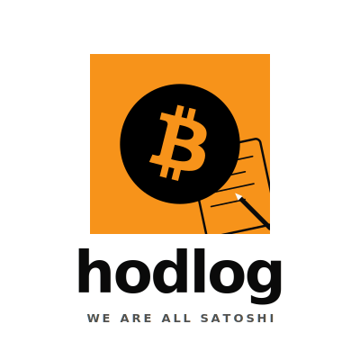

<picture>
  <source media="(prefers-color-scheme: dark)" srcset="./wordmark-vertical-dark.svg">
  <source media="(prefers-color-scheme: light)" srcset="./wordmark-vertical-light.svg">
  
</picture>

 
 

**Bitcoin DCA tracker for maximalists.**  
**We are all Satoshi.**

---

## About

**Hodlog**는 비트코인 맥시멀리스트를 위한 조용한 도구를 만듭니다.

광고, 트레이딩 유도, FOMO 마케팅 없이 — 진짜 필요한 것만 담습니다.

매일 한 사토시의 지혜를 전하고, 당신의 장기 홀딩 여정을 기록합니다.

---

## Projects

### 📱 [Hodlog](https://hodlog.app)
Daily Bitcoin wisdom + DCA tracker.  
*Currently in MVP development · Beta launch: Summer 2026*

### 📚 Hodlog Bookclub *(coming soon)*
Curated Bitcoin reading list with affiliate partnerships.

---

## Our Philosophy

- **Bitcoin only.** No altcoins, ever.
- **No ads.** No B2B sales. No NFTs.
- **Handcrafted content.** No AI-generated wisdom.
- **Quiet product.** No FOMO, no hype.
- **Anonymous by default.** Nickname-based identity.

---

**우리는 모두 사토시다.**

© 2026 Hodlog · Made with 🟠 in Seoul

